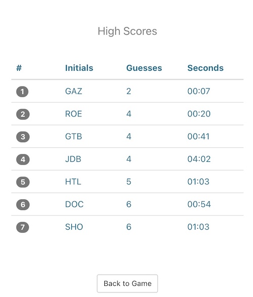

# Mastermind: break the hidden code!

[Mastermind is now live!](https://mastermindbuild.azurewebsites.net/)

Mastermind is a code breaking game where one player (or the computer) chooses a code that's hidden from the other playing who wants to crack the code.

Mastermind allow users to:
- Develop strategies to most efficiently decipher the code
- Submit scores to the database, comparing time and number of guesses to compete for the top 20!
- Choose game difficulty
- Check out your competition by viewing the High Scores page.


## Contents
- [Technologies](#Technologies)
- [Building](#Development)
- [Requirements](#Requirements)
- [API documentation](#api-documentaton)

## Screenshots
### Game


### HighScore



### Difficulty Selection


### Page Speed


## Technologies
React, Docker, MongoDB, Azure B1S VM, Node.js, Express.js, Azure Container Instances

## Development


## Requirements


- Node v12.18.4


- MongoDB v4.4.0


### Installing and running the application

From project directory:
Install dependencies.
```sh
npm install
```

Start the server
```sh
npm start
```

## API documentation


## My Other Games

  - [TETRIS](https://github.com/coffeesnakes/tetris_JS "Tetris")
  - [TICTACTOE](https://github.com/coffeesnakes/tictactoeJS "Tic-Tac-Toe")
  - [SNAKE](https://github.com/coffeesnakes/snekGame "Snake")


### System Design

## Version 1