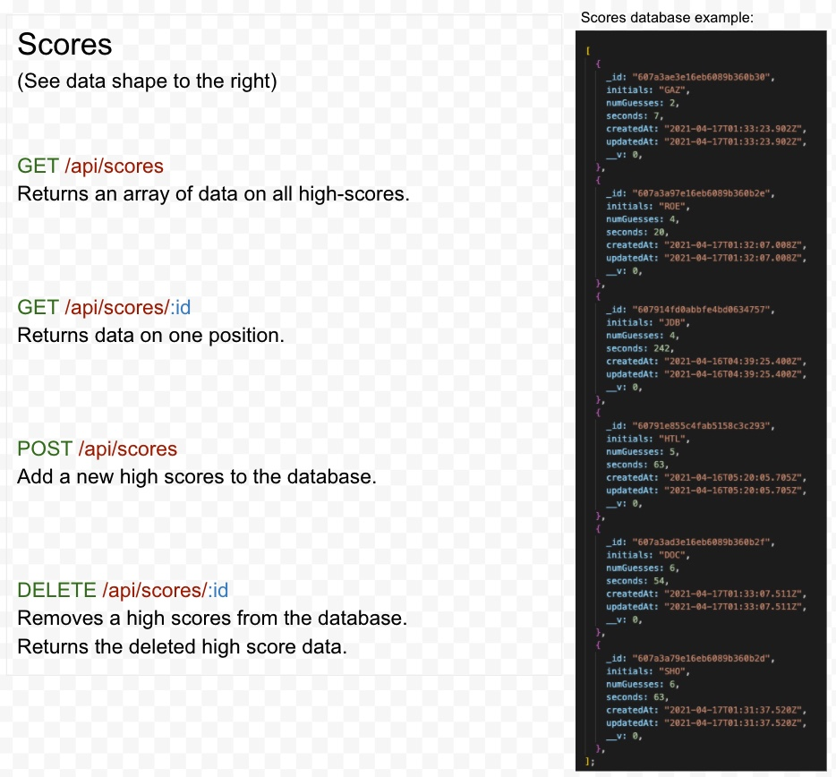

[![LinkedIn][linkedin-shield]][linkedin-url]
# Mastermind: break the hidden code!

[Mastermind is now live!](https://mastermindbuild.azurewebsites.net/)

Mastermind is a code breaking game where one player (or the computer) chooses a code that's hidden from the other playing who wants to crack the code.


Mastermind allow users to:
- Develop strategies to most efficiently decipher the code
- Submit scores to the database, comparing time and number of guesses to compete for the top 20!
- Choose game difficulty
- Check out your competition by viewing the High Scores page.


## Contents
- [Technologies](#Technologies)
- [Getting Started](#Development)
- [Prerequisites](#Prerequisites)
- [API documentation](#api-documentaton)

## Screenshots
### Game


### HighScore


### Difficulty Selection


### Page Speed


## Development
<p>&nbsp;</p>

## Technologies
React, Docker, MongoDB, Azure B1S VM, Node.js, Express.js, Azure Container Instances

<p>&nbsp;</p>

## Prerequisites


- Node v12.18.4

- npm v7.10.0

- MongoDB v4.4.0

<p>&nbsp;</p>


## Installing and running the application
<p>&nbsp;</p>


From project directory:
Install dependencies.
```sh
npm install
```

Start the server
```sh
npm start
```

<p>&nbsp;</p>
<p>&nbsp;</p>


## API documentation




<p>&nbsp;</p>
<p>&nbsp;</p>


### System Design

<p>&nbsp;</p>

## Version 1

**The Minimum Viable Product:**
The target, was simple, minimal, and durable. Essentially I wanted something that had all of the bare functionalities necessary to play the game with an integrated API for the hidden code. There was never any intent to design anything more for the initial product. It wasn't meant to be beautiful, but rather intuitive so the user can experience the core game without frustration
- Integrated API from [Random.org](https://www.random.org/) to generate code
- Setup numeric value inputs via on-click functionality
- Provided a feedback system that utilizes position and values of guess and responds with number of exact or close guesses.
- Tracked and displayed remaining number of attempts on the client.


<p>&nbsp;</p>
<p>&nbsp;</p>

## Version 2

**Ready for production:**
When figuring out the scope of this refactor I decided to introduce a workflow that has worked for me in the past. I introduced a [ticketing system](https://trello.com/b/w2M2GfG9/mastermind-project) so I could break the project down into small user stories and then prioritize. By setting up my tickets daily I was able to continuously deliver great work.

<p>&nbsp;</p>

This full-stack version of Mastermind builds upon the prototype but is vastly different with many new features.

- Modularized components
- Design Patterns for state management
- Colored Pegs chosen via on-click functionality
- A more minimalistic feedback system
- Top 20 high scores get saved to the database
- A timer now introduces a new mechanic to prompt quick thinking
- Multiple difficulty levels that introduce new pegs
- Containerized with Docker and deployed on Azure


## My Other Games

  - [TETRIS](https://github.com/coffeesnakes/tetris_JS "Tetris")
  - [TICTACTOE](https://github.com/coffeesnakes/tictactoeJS "Tic-Tac-Toe")
  - [SNAKE](https://github.com/coffeesnakes/snekGame "Snake")


[linkedin-shield]: https://img.shields.io/badge/-LinkedIn-black.svg?style=for-the-badge&logo=linkedin&colorB=555
[linkedin-url]: https://www.linkedin.com/in/coffeesnakes/